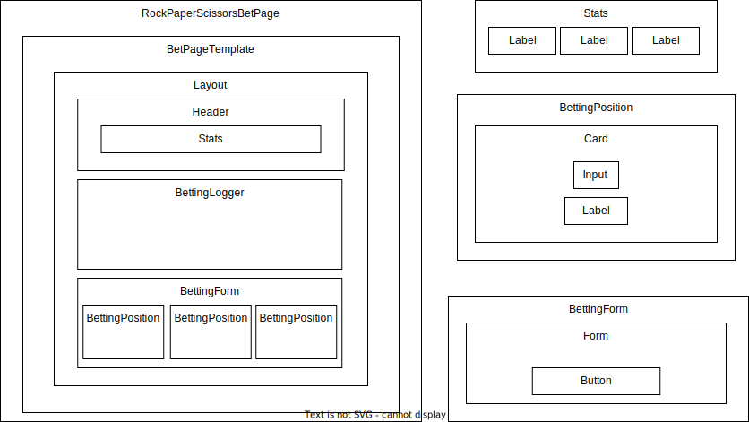

# Rock Paper Scissors Bet game

This project is a web application that allows the user to bet on a game of rock paper scissors.

# Table of Contents

- [Rock Paper Scissors Bet game](#rock-paper-scissors-bet-game)
- [Table of Contents](#table-of-contents)
- [Methodologies](#methodologies)
- [Libraries](#libraries)
- [UI Components Breakdown](#ui-components-breakdown)
    - [Atoms](#atoms)
    - [Molecules](#molecules)
    - [Organisms](#organisms)
    - [Templates](#templates)
    - [Pages](#pages)
- [Components Folder Structure](#components-folder-structure)
- [State Management](#state-management)
- [Code Quality](#code-quality)
  - [Test Driven Development](#test-driven-development)
  - [Linting](#linting)
  - [Storybook](#storybook)
  - [Conventions](#conventions)
- [Tickets Breakdown](#tickets-breakdown)
    - [Ticket 1: Project Setup](#ticket-1-project-setup)
    - [Ticket 2: Create Atoms](#ticket-2-create-atoms)
    - [Ticket 3: Create Molecules](#ticket-3-create-molecules)
    - [Ticket 4: Create Organisms](#ticket-4-create-organisms)
    - [Ticket 5: Create Templates](#ticket-5-create-templates)
    - [Ticket 6: Create Pages](#ticket-6-create-pages)
    - [Ticket 7: Implement Redux Slices](#ticket-7-implement-redux-slices)
    - [Ticket 8: Style Components with Tailwind CSS](#ticket-8-style-components-with-tailwind-css)
    - [Ticket 9: Testing and Bug Fixes](#ticket-9-testing-and-bug-fixes)
- [Getting Started](#getting-started)
  - [Available Scripts](#available-scripts)
    - [`yarn start`](#yarn-start)
    - [`yarn test`](#yarn-test)
    - [`yarn build`](#yarn-build)
    - [`yarn eject`](#yarn-eject)
    - [`yarn commit`](#yarn-commit)
# Methodologies

- Atomic Design: https://bradfrost.com/blog/post/atomic-web-design/
- Test Driven Development: https://en.wikipedia.org/wiki/Test-driven_development
- Utility-first CSS: https://tailwindcss.com/docs/utility-first
- Reactive Programming: https://en.wikipedia.org/wiki/Reactive_programming

# Libraries

- Redux: https://redux.js.org/
- Redux Toolkit: https://redux-toolkit.js.org/
- Redux Observable: https://redux-observable.js.org/
- RxJS: https://rxjs.dev/
- Storybook: https://storybook.js.org/
- Cypress: https://www.cypress.io/
- Tailwind CSS: https://tailwindcss.com/
- React Testing Library: https://testing-library.com/docs/react-testing-library/intro/
- Husky: https://typicode.github.io/husky/#/
  
# UI Components Breakdown
By following the [Atomic design Methodology]( https://bradfrost.com/blog/post/atomic-web-design/), we can break down the UI components into 5 categories: Atoms, Molecules, Organisms, Templates and Pages.

### Atoms
- Button: The button that performs an action onclick to bet.
- Input: The input that allows the user to enter the amount to bet.
- Label: The label that names the user stats in the header.

### Molecules
- Form: The form that wraps the Inputs and Button to bet.
- Card: The card that wraps Input and Label to present betting positions.
  
### Organisms
- Header: The header that wraps user stats.
- BettingPosition: The betting position that Implements Card and abstract the logic of betting position.
- Stats: The stats that wraps Label amd values to present user stats in the header.
- BettingForm: Uses a Form and BettingPositions to handle the betting logic.
- BettingLogger: logs the bet results.

### Templates
- BetPageTemplate: Configures the layout of the page and places the components as well as the logic of the page.
  
### Pages
- RockPaperScissorsBetPage: Contains the business specific logic of the page and uses the BetPageTemplate to render the page, its in charge of collect data from external sources and pass it to the template.

# Components Folder Structure

    src/
    ├── components/
    │   ├── atoms/
    │   │   ├── Button/
    │   │   ├── Input/
    │   │   ├── Label/
    │   ├── molecules/
    │   │   ├── Form/
    │   │   ├── Card/
    │   ├── organisms/
    │   │   ├── Header/
    │   │   ├── Layout/
    │   │   ├── BettingPosition/
    │   │   ├── Stats/
    │   │   ├── BettingForm/
    │   │   ├── BettingLogger/
    │   ├── templates/
    │   │   ├── BetPageTemplate/
    │   ├── pages/
    │   │   ├── RockPaperScissorsBetPage/

# State Management

The state management is implemented using Redux and Redux Observable, the state is divided into 3 slices:
- Players: Contains the users stats.
- Games: Contains the game data.
- Logger: Contains the log of the game.

The main reason to use Redux is to have a single source of truth, and the main reason to use Redux Observable is to handle the side effects of the application in a reactive way.

# Code Quality

## Test Driven Development

Using Jest and React Testing Library for unit testing and Cypress for end to end testing.

## Linting

Using ESLint, StyleLint and Prettier with Husky to enforce code quality and consistency.

## Storybook

Using Storybook to develop UI components in isolation and document them.

## Conventions

- Conventional Commits: https://www.conventionalcommits.org/en/v1.0.0/
- git flow: https://www.atlassian.com/git/tutorials/comparing-workflows/gitflow-workflow

# Tickets Breakdown

### Ticket 1: Project Setup
<b>Backlog:</b> Review project requirements and determine the necessary libraries and methodologies.
<b>To Do:</b> Set up the project environment with Redux, Redux Toolkit, Redux Observable, RxJS, Storybook, Cypress, Tailwind CSS, React ,Testing Library, and Husky.
<b>In Progress:</b> Configure ESLint, StyleLint, and Prettier for consistent code formatting. Use Husky for pre-commit hooks.
<b>Testing:</b> Ensure all dependencies are installed and correctly configured.
<b>Done:</b> When the development environment is fully set up and functional.

<b>Status</b>: To Do

### Ticket 2: Create Atoms
<b>Backlog:</b> Review the Atomic Design Methodology and understand the required atomic components.
<b>To Do:</b> Develop Button, Input, and Label components, including their stories in Storybook.
<b>In Progress:</b> Test each component using React Testing Library.
<b>Testing:</b> Verify each component's appearance and functionality in isolation and in Storybook.
<b>Done:</b> When all atomic components are developed, tested, and documented in Storybook.

<b>Status</b>: To Do

### Ticket 3: Create Molecules
<b>Backlog:</b> Identify required molecules based on design requirements.
<b>To Do:</b> Develop Form and Card components, including their stories in Storybook.
<b>In Progress:</b> Test each component using React Testing Library.
<b>Testing:</b> Verify each component's appearance and functionality in isolation and in Storybook.
<b>Done:</b> When all molecular components are developed, tested, and documented in Storybook.

<b>Status</b>: To Do
### Ticket 4: Create Organisms
<b>Backlog:</b> Understand how atoms and molecules form more complex structures.
<b>To Do:</b> Develop Header, BettingPosition, Stats, BettingForm, and BettingLogger components, including their stories in Storybook.
<b>In Progress:</b> Test each component using React Testing Library.
<b>Testing:</b> Verify each component's appearance and functionality in isolation and in Storybook.
<b>Done:</b> When all organism components are developed, tested, and documented in Storybook.

<b>Status</b>: To Do

### Ticket 5: Create Templates
<b>Backlog:</b> Define the layout and composition of the page.
<b>To Do:</b> Develop the BetPageTemplate component.
<b>In Progress:</b> Test the template using React Testing Library.
<b>Testing:</b> Verify the template's appearance and functionality in isolation and in Storybook.
<b>Done:</b> When the BetPageTemplate is developed, tested, and documented in Storybook.

<b>Status</b>: To Do

### Ticket 6: Create Pages
<b>Backlog:</b> Define the business logic and state handling of the page.
<b>To Do:</b> Develop the RockPaperScissorsBetPage component.
<b>In Progress:</b> Integrate Redux and Redux Observable to manage state and side effects.
<b>Testing:</b> Test the page with React Testing Library and Cypress for end-to-end testing.
<b>Done:</b> When the page component is fully functional and tested.

<b>Status</b>: To Do

### Ticket 7: Implement Redux Slices
<b>Backlog:</b> Understand the required slices for state management.
<b>To Do:</b> Develop Players, Games, and Logger slices.
<b>In Progress:</b> Connect slices to components and test their behavior.
<b>Testing:</b> Test each slice and its integration with Redux and Redux Observable.
<b>Done:</b> When all slices are implemented, tested, and functioning correctly.

<b>Status</b>: Backlog

### Ticket 8: Style Components with Tailwind CSS
<b>Backlog:</b> Review the design requirements and understand how to apply styles with Tailwind CSS.
<b>To Do:</b> Apply styles to all components using Tailwind CSS.
<b>In Progress:</b> Test each component to ensure its appearance matches the design requirements.
<b>Testing:</b> Review all components and verify their appearance with the provided mockups.
<b>Done:</b> When all components are styled correctly and match the provided mockups.

<b>Status</b>: Backlog

### Ticket 9: Testing and Bug Fixes
<b>Backlog:</b> Review all implemented features and identify any potential issues.
<b>To Do:</b> Write more extensive unit tests with Jest and React Testing Library, and end-to-end tests with Cypress.
<b>In Progress:</b> Debug and fix any identified issues.
<b>Testing:</b> Ensure all tests pass and no known bugs are left.
<b>Done:</b> When all components are fully functional, tested, and no known bugs are left.

<b>Status</b>: Backlog

# Getting Started 

This project was bootstrapped with [Create React App](https://github.com/facebook/create-react-app).

## Available Scripts

In the project directory, you can run:

### `yarn start`

Runs the app in the development mode.\
Open [http://localhost:3000](http://localhost:3000) to view it in the browser.

The page will reload if you make edits.\
You will also see any lint errors in the console.

### `yarn test`

Launches the test runner in the interactive watch mode.\
See the section about [running tests](https://facebook.github.io/create-react-app/docs/running-tests) for more information.

### `yarn build`

Builds the app for production to the `build` folder.\
It correctly bundles React in production mode and optimizes the build for the best performance.

The build is minified and the filenames include the hashes.\
Your app is ready to be deployed!

See the section about [deployment](https://facebook.github.io/create-react-app/docs/deployment) for more information.

### `yarn eject`

**Note: this is a one-way operation. Once you `eject`, you can’t go back!**

If you aren’t satisfied with the build tool and configuration choices, you can `eject` at any time. This command will remove the single build dependency from your project.

Instead, it will copy all the configuration files and the transitive dependencies (webpack, Babel, ESLint, etc) right into your project so you have full control over them. All of the commands except `eject` will still work, but they will point to the copied scripts so you can tweak them. At this point you’re on your own.

You don’t have to ever use `eject`. The curated feature set is suitable for small and middle deployments, and you shouldn’t feel obligated to use this feature. However we understand that this tool wouldn’t be useful if you couldn’t customize it when you are ready for it.

### `yarn commit`

Runs the [commitizen CLI](https://github.com/commitizen/cz-cli) to help you write conventional commit messages.